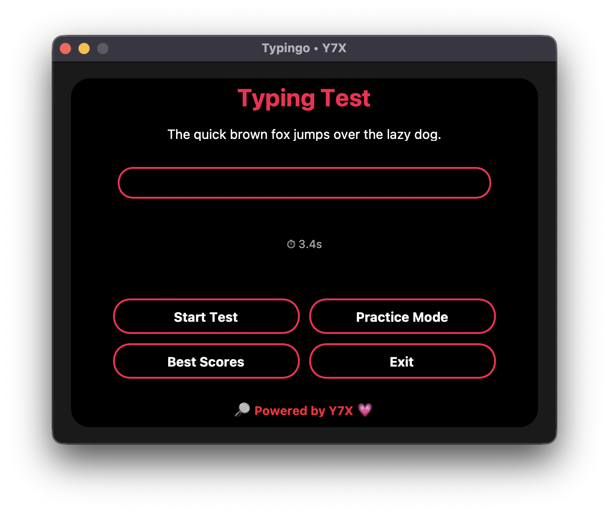

# ⚡ Typingo • Powered by Y7X 💗

**Typingo** is your ultimate custom-built typing test app — redesigned with an **AMOLED interface**, glowing red outlines, bold layout, and a responsive UX. Built using `customtkinter`, this isn't your average typing tool — it’s **precision meets aesthetic**.

---

## 🖥️ Features
- 🔴 **AMOLED UI** with glowing red accents
- ✍️ **Case-sensitive typing test** with typo feedback
- 🔁 **Practice Mode** with auto-progress and summary
- 🧠 **WPM & Accuracy calculation**
- 🧊 Smooth, pill-shaped buttons with hover glow
- 💡 Real-time feedback with ❌ typo markers
- 🔓 Best score tracking with local storage
- 🔎 **Powered by Y7X 💗** branding at the bottom

---

## 📸 UI Preview



---

## 🚀 Run It

```bash
pip install customtkinter
python main.py