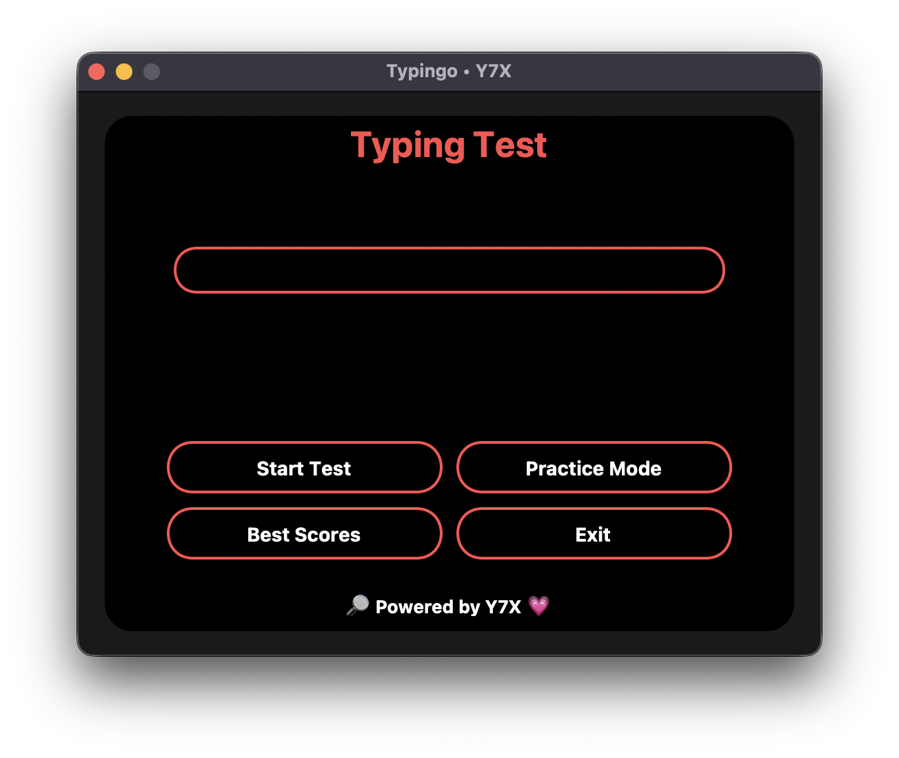

<div align="center">

# ⚡ Typingo
**🎯 Where Precision Meets Performance**

Typingo is your ultimate custom-built typing test app redesigned with an **AMOLED interface**, glowing red outlines, bold layout, and a responsive UX. Built using `customtkinter`, this isn't your average typing tool it’s **precision meets aesthetic**.
Branded with 💗 by [Y7X-bit](https://github.com/Y7X-bit)



</div>

---

## 🌟 Features at a Glance

- 🔴 **AMOLED UI** with glowing red accents
- ✍️ **Case-sensitive typing test** with typo feedback
- 🔁 **Practice Mode** with auto-progress and summary
- 🧠 **WPM & Accuracy calculation**
- 🧊 Smooth, pill-shaped buttons with hover glow
- 💡 Real-time feedback with ❌ typo markers
- 🔓 Best score tracking with local storage
- 🔎 **Powered by Y7X 💗** branding at the bottom

---

## 🖥️ Installation

> Python 3.9 or later required

```bash
git clone https://github.com/Y7X-bit/Typingo.git
cd Typingo
pip install -r requirements.txt
python typingo.py